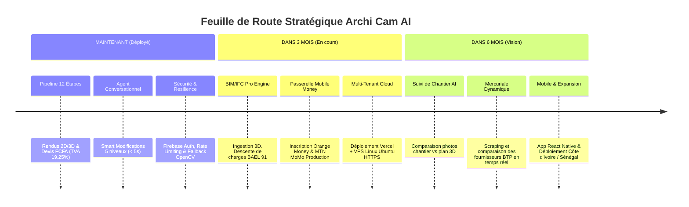

# 🏛️ ARCHI CAM AI — Document de Référence Unique

> **Version** : 2.0.0 (Production Ready)  
> **Date de révision** : Août 2026  
> **Statut** : Document Maître Consolidé (Remplace `walkthrough.md`, `DEPLOYMENT.md` et tous les rapports d'intégration)

---

## SECTION 1 — QU'EST-CE QU'ARCHI CAM AI ?

**Archi Cam AI** est la première plateforme SaaS d'IA générative et d'ingénierie agentique spécialisée dans l'architecture et le BTP au Cameroun et en Afrique Centrale.

* **Problème résolu** : La lenteur et le coût prohibitif de la conception architecturale, de l'estimation budgétaire et de l'analyse de conformité pour les particuliers et les cabinets de BTP.
* **Pour qui ?** : Les particuliers (propriétaires fonciers), les architectes, les bureaux d'études structures (BIM/IFC) et les entreprises du BTP.
* **Comment ?** : En transformant un croquis scanné, un plan PDF 2D ou un modèle 3D IFC en **rendus 3D photoréalistes HD** et en **devis quantitatifs (DQE/DPGF) certifiés en FCFA** grâce à un pipeline agentique hybride à 12 étapes.
* **Différenciation** : Intégration native des **règles d'urbanisme locales (POS)**, de la **géotechnique LABOGENIE**, de la **Mercuriale des prix certifiés MINMAP 2026**, du calcul **BAEL 91**, du paiement **Mobile Money (Orange Money & MTN MoMo)** et d'un **agent conversationnel réactif**.
* **Modèle Économique** : SaaS Freemium B2B/B2C par abonnements mensuels (Free : 0 FCFA, Starter : 10 000 FCFA, Pro : 25 000 FCFA, Enterprise : 150 000 FCFA/mois).

---

## SECTION 2 — ARCHITECTURE EN UN COUP D'ŒIL

### 📡 Pipeline Agentique Consolidé à 12 Étapes

```mermaid
graph TD
    A["1. Upload Plan / Scan / IFC"] --> B["2. Sécurité & Rate Limiter (verifyFirebaseToken)"]
    B --> C["3. Empreinte SHA256 & Cache DuckDB (0s si récurrent)"]
    C --> D{"4. Aiguillage par Type de Fichier"}
    
    D -->|Fichier .IFC (Pro)| E1["Ingestion IfcOpenShell + Descente Charges BAEL 91"]
    D -->|PDF / Image 2D| E2["Visual Brain (YOLO -> Gemma 4 12B QAT / Gemini 2.5) + Zod"]
    
    E2 --> F["5. Prétraitement OpenCV (4 Calques: Clean, Canny, Depth, Text)"]
    F --> G["6. Enrichissement GraphRAG Neo4j (POS Urbanisme, Sols, MINMAP 2026)"]
    G --> H{"7. Cascade Rendu 3D Self-Healing (4 Moteurs)"}
    
    H -->|Moteur 1| M1["Gemini Imagen 3"]
    M1 -->|Fallback 2| M2["Replicate ControlNet SDXL"]
    M2 -->|Fallback 3| M3["OpenAI DALL-E 3 (Rotation 3 Clés)"]
    M3 -->|Fallback 4 Offline| M4["OpenCV 2.5D Local Garanti"]
    
    E1 & H --> I["8. Calcul Devis DQE/DPGF FCFA (TVA 19.25% + 5% Imprévus)"]
    I --> J["9. Filigrane Conditionnel OpenCV & Stockage (Firebase Storage / Local)"]
    J --> K["10. Restitution UI React (RenderComparator + InteractiveQuote + Export PDF)"]
    K --> L["11. Compilation Dossier OKF v0.2 & Tracing DuckDB"]
    L --> M["12. Agent Conversationnel (Smart Modification 5 Niveaux < 5s)"]
```

### 📋 Tableau des Services et Ports System

| Service | Port | Protocol | Rôle Technique | Critique | Fallback |
|:---|:---|:---|:---|:---|:---|
| **Next.js App Router** | `:3000` | HTTP / SSE | Dashboard Web, Routes API Serverless, UI | **OUI** | Aucun |
| **FastMCP Workers** | `:8000` | HTTP JSON-RPC | Moteur OpenCV 2.5D, Métrés BTP, IFC Parser | **OUI** | API Directe |
| **Firebase Services** | `:4000` | HTTP REST | Auth, Firestore, Storage, Security Rules | **OUI** | Mode Bypass Dev |
| **DuckDB Analytics** | `embed` | Native OLAP | Journalisation 7 tables, Cache Sémantique, Stats | **OUI** | NoOp Manager |
| **Neo4j GraphRAG** | `:7687` | Bolt / `:7474` | Ontologie BTP, POS Villes, Mercuriale MINMAP | **NON** | Règles Locales |
| **ADK Agents API** | `:8080` | HTTP REST | Réseau d'Agents Python (Router, Engineer, Orchestrator) | **NON** | FastMCP Direct |
| **LM Studio** | `:1234` | HTTP REST | MiniCPM-V 2.6 / Gemma 4 12B QAT (VLM Souverain Local) | **NON** | Gemini Cloud API |
| **Agent Skills Engine** | `embed` | File System | Compétences Métier (`.agents/skills/`) : DQE, Urbanisme, Bioclimatique | **OUI** | Context Prompts |
| **Quality Audit Loop** | `embed` | Python Module | Garde-fou Anti-Hallucination (`quality_audit_loop.py`, Canny < 0.35) | **OUI** | Fallback OpenCV |

---

### 🧩 Système d'Agent Skills (`.agents/skills/`) & Contrôle Qualité

Le système s'appuie désormais sur une architecture de compétences modulaires autonomes inspirée des standards d'agents modernes :
* 📦 **`btp-cameroun-dqe`** : Normes BAEL 91, dosages béton (350kg/m³), ratios d'acier et mercuriale des prix FCFA (Douala/Yaoundé).
* 🏛️ **`urbanisme-cameroun`** : Loi 2004/003, surfaces minimales (chambres $\ge 9\text{ m}^2$, HSP $\ge 2.80\text{ m}$), reculs POS et pièces du Permis de Bâtir.
* 🌿 **`bioclimatisme-tropical`** : Orientation solaire Est-Ouest, ventilation croisée, masques thermiques, albédo et bois locaux (Iroko).
* 🔒 **`quality_audit_loop.py`** : Contrôle automatique de fidélité Canny ($< 0.35$). Si le score de dérive dépasse le seuil, une boucle de re-prompting ou le basculement vers le Moteur 4 OpenCV local s'active automatiquement.
* 🧪 **`benchmark_vlm_minicpm.py`** : Suite de tests automatisés évaluant la performance et la vitesse de réponse du VLM MiniCPM-V 2.6 sur LM Studio.

---

## SECTION 3 — DEUX ESPACES CLIENTS

| Critère | Espace Particulier | Espace Professionnel BIM / IFC |
|:---|:---|:---|
| **Format d'entrée** | PDF 2D / JPG / PNG / Croquis Stylo | Fichiers 3D OpenBIM `.ifc` / `.ifczip` |
| **Engine d'analyse** | YOLO + LM Studio Gemma 4 12B / Gemini | Parsing exact `IfcOpenShell` (C++) |
| **Précision géométrique**| Estimée ($\pm 20\%$) | Exacte volumétrique ($\pm 5\%$) |
| **Calculs de structure**| Prédimensionnement standard | Descente de charges BAEL 91 ($1.35G + 1.5Q$) |
| **Précision du devis** | Estimative / Indicative | Certifiable pour Marchés Publics / Banques |
| **Livrables générés** | Devis DQE PDF + Rendu 3D HD | DPGF + BPU + CCTP + Planning Gantt + PDF |
| **Temps de traitement** | $40\text{ s}$ à $60\text{ s}$ | $80\text{ s}$ à $120\text{ s}$ |
| **Plans tarifaires** | **Free** (0 FCFA) / **Pro** (25 000 FCFA/m) | **Pro** (25k FCFA) / **Enterprise** (150k FCFA/m) |

---

## SECTION 4 — FICHIERS CRITIQUES (Carte du Code)

Voici les **15 fichiers fondamentaux** que tout développeur doit comprendre avant de contribuer :

1. `app/api/render/image/route.ts`  
   $\rightarrow$ Point d'entrée principal du pipeline 2D/3D. *Ne jamais supprimer le fallback OpenCV 2.5D.*
2. `lib/genkit-agent.ts`  
   $\rightarrow$ Agent principal TypeScript Genkit et pont HTTP. *Ne jamais utiliser `child_process` ici.*
3. `archi_agents/orchestrator/agentic_orchestrator.py`  
   $\rightarrow$ Orchestrateur central Python. Gère les 4 agents et la rotation des 3 clés OpenAI.
4. `fastmcp/main.py`  
   $\rightarrow$ Serveur FastMCP exposant les outils BTP (`run_metreur`, `run_structure`, `/modify-texture`).
5. `lib/validators/plan-analysis-schema.ts`  
   $\rightarrow$ Schémas Zod (`LMStudioPlanAnalysisSchema`) et fonction `autoCorrectAnalysis()` anti-crash.
6. `lib/lm-studio-analyzer.ts`  
   $\rightarrow$ Connecteur vers Gemma 4 12B QAT local via LM Studio (`:1234`).
7. `lib/prompts/render-prompts.ts`  
   $\rightarrow$ Générateur du Prompt Maître avec injection contextuelle Neo4j (POS, matériaux, climat).
8. `lib/quote/geometry-to-quote.ts`  
   $\rightarrow$ Calculateur du devis FCFA avec TVA 19.25%, imprévus 5% et Guardrails BTP.
9. `scripts/generate_photoshop_2d_plan.py`  
   $\rightarrow$ Script OpenCV générant les 4 calques (`_clean`, `_canny`, `_depth`, `_text`) et le filigrane.
10. `scripts/duckdb_manager.py`  
    $\rightarrow$ Base de données OLAP DuckDB (7 tables : renders, quotes, metrics, semantic_cache, user_usage).
11. `knowledge_base/neo4j_btp_schema.cypher`  
    $\rightarrow$ Ontologie Neo4j du BTP Cameroun (POS, Sols LABOGENIE, Mercuriale MINMAP 2026).
12. `lib/auth/verify-firebase-token.ts`  
    $\rightarrow$ Vérificateur de token Firebase Server-Side avec contrôle du flag `NEXT_PUBLIC_BYPASS_AUTH`.
13. `lib/agents/modification-classifier.ts`  
    $\rightarrow$ Classifier réactif ($< 500\text{ ms}$) découpant les modifs en 5 niveaux d'exécution.
14. `components/chat/ConversationalAgent.tsx`  
    $\rightarrow$ Composant UI React du tchat interactif (historique 10 versions, badges impact FCFA, annulation).
15. `Lancer_Archi_Cam_AI.bat`  
    $\rightarrow$ Script d'orchestration de démarrage unifié en 5 terminaux sous Windows.

---

## SECTION 5 — LANCER LE PROJET EN LOCAL (10 minutes)

### Prérequis indispensables :
* **Node.js** v20+ & **npm** v10+
* **Python** v3.11+ (avec `venv`)
* **Docker Desktop** (avec Docker Compose)
* **Git**

### 🛠️ Procédure d'installation et de lancement pas-à-pas :

#### Étape 1 : Cloner le dépôt et installer les dépendances
```bash
git clone https://github.com/votre-compte/archi-cameroun-ai.git
cd archi-cameroun-ai

# Dépendances Node.js
npm install

# Dépendances Python (Virtualenv)
python -m venv .venv
.venv\Scripts\activate
pip install -r requirements.txt
```

#### Étape 2 : Configurer les variables d'environnement
```bash
cp .env.local.example .env.local
```
*Vérifiez au minimum dans `.env.local`* :
```env
GEMINI_API_KEY=AIzaSyBmlt...
NEO4J_PASSWORD=password123
NEXT_PUBLIC_BYPASS_AUTH=true
```

#### Étape 3 : Démarrer les 5 services unifiés (1 Clic)
```cmd
"C:\Users\HP\Desktop\Archi Cam AI\Lancer_Archi_Cam_AI.bat"
```

#### Étape 4 : Vérifier la santé du système
```bash
curl http://localhost:3000/api/health
# Attendu : {"status":"ok","services":{"fastmcp":true,"duckdb":true}}
```

#### Étape 5 : Lancer le test d'intégration rapide
```bash
npm run test:render-only
# Attendu : TEST_4A PASSED en < 60s
```

---

## SECTION 6 — DÉPLOYER EN PRODUCTION

Le déploiement se fait selon une architecture découplée **Vercel Serverless (Frontend)** + **VPS Cloud Ubuntu Docker (Workers Python & GraphRAG)**.

```
┌─────────────────────────────────────────────────────────────┐
│  Vercel Serverless (Paris cdg1)    VPS Ubuntu 22.04 LTS     │
│  https://archicamai.cm             https://vps.archicamai.cm│
│                                                             │
│  → Next.js 14 App Router           → FastMCP Worker (:8000) │
│  → Auth & Storage Firebase Prod    → Neo4j GraphRAG (:7687) │
│  → Mobile Money Payments           → OpenCV & IfcOpenShell  │
│  → FastMCP Bridge HTTPS            → Nginx SSL Let's Encrypt│
└─────────────────────────────────────────────────────────────┘
```

### 🚀 Procédure de déploiement en 3 étapes :

#### ÉTAPE A — Déploiement du VPS Cloud Ubuntu (Python Workers & Neo4j)
Sur votre VPS Ubuntu (4GB RAM minimum, ports 80, 443 et 7687 ouverts) :
```bash
chmod +x scripts/deploy-vps.sh
./scripts/deploy-vps.sh vps.archicamai.cm admin@archicamai.cm
```

#### ÉTAPE B — Déploiement Frontend Next.js sur Vercel
```bash
npx vercel --prod
```
*Configurez les variables dans le Dashboard Vercel (`FASTMCP_BASE_URL=https://vps.archicamai.cm`, `FIREBASE_USE_EMULATOR=false`).*

#### ÉTAPE C — Déploiement des Règles de Sécurité Firebase
```bash
npx firebase-tools deploy --only firestore:rules,storage:rules
```

### 🚦 Critère GO / NO-GO Production :
Le déploiement est validé **uniquement si 22/22 tests critiques passent** avec la commande :
```bash
npm run test:integration -- --target=production
```

---

## SECTION 7 — RÈGLES ABSOLUES (Ne Jamais Violer)

> [!CAUTION]
> Ces 10 règles sont nées de corrections de bugs réels. Leur non-respect entraînera une panne immédiate.

1. **RÈGLE 1 — Jamais de `child_process` dans Next.js App Router** : Toute communication avec Python doit passer par des requêtes `fetch()` HTTP vers FastMCP (`:8000`) ou l'ADK (`:8080`). *(Fichier concerné : `lib/genkit-agent.ts`)*.
2. **RÈGLE 2 — Jamais de `response_format` dans l'API Image d'OpenAI** : Les modèles de génération d'images DALL-E 3 rejettent ce paramètre JSON. *(Fichier concerné : `lib/bridges/openai-bridge.ts`)*.
3. **RÈGLE 3 — Jamais d'URL `localhost` transmises à Replicate** : Replicate s'exécute dans le cloud distant. Convertir impérativement les images locales en Data URI Base64. *(Fichier concerné : `lib/bridges/controlnet-bridge.ts`)*.
4. **RÈGLE 4 — Un seul mot de passe Neo4j dans tout le projet** : Mot de passe unifié sur `password123` en dev (ou lu depuis `process.env.NEO4J_PASSWORD`). Ne jamais avoir de valeurs divergentes dans les scripts.
5. **RÈGLE 5 — Une seule analyse sémantique par rendu** : Le résultat de l'analyse est mis en cache dans le `sharedContext`. Ne jamais appeler simultanément LM Studio ET Gemini pour le même plan.
6. **RÈGLE 6 — Le fallback OpenCV 2.5D ne peut jamais être supprimé** : C'est le garant d'une réponse HTTP 200 même si internet ou tous les services d'IA cloud tombent en panne. *(Fichier concerné : `app/api/render/image/route.ts`)*.
7. **RÈGLE 7 — OKF compilé après chaque rendu réussi** : Chaque génération doit produire ou mettre à jour le dossier structuré OKF v0.2. *(Fichier concerné : `lib/agents/okf-compiler-agent.ts`)*.
8. **RÈGLE 8 — Zod valide TOUJOURS les réponses du VLM** : Ne jamais appliquer `JSON.parse` directement sur une sortie d'IA sans la passer par `LMStudioPlanAnalysisSchema.safeParse()`. *(Fichier concerné : `lib/validators/plan-analysis-schema.ts`)*.
9. **RÈGLE 9 — Nettoyage systématique du BOM UTF-8 et des caractères de contrôle avant JSON** : Utiliser la fonction centralisée `safeJsonParse()`. *(Fichier concerné : `app/api/render/image/route.ts`)*.
10. **RÈGLE 10 — Aucun service optionnel ne crashe la route principale** : Si Neo4j est absent $\rightarrow$ Warning. Si DuckDB échoue $\rightarrow$ NoOp. Si LM Studio tombe $\rightarrow$ Bascule Gemini. Aucune exception non interceptée ne doit bloquer la réponse HTTP 200.

---

## SECTION 8 — ROADMAP PRODUIT



---

## SECTION 9 — FAQ TECHNIQUE

**Q : Que se passe-t-il si la connexion Internet est totalement coupée ?**  
*R* : Le système bascule automatiquement sur l'analyseur local (LM Studio / Gemma 4 12B QAT) et le moteur de rendu mathématique **OpenCV 2.5D Local**. Le rendu et le devis FCFA sont générés en $100\%$ local sans aucune erreur HTTP.

**Q : Que se passe-t-il si l'application LM Studio n'est pas lancée ?**  
*R* : Le système détecte l'absence du serveur local (`:1234`) en $< 500\text{ ms}$ et bascule en toute transparence sur l'API **Gemini 2.5 Flash / Pro Cloud**.

**Q : Que se passe-t-il si la base de données Neo4j est vide ou non démarrée ?**  
*R* : Le pont `cesium-neo4j-bridge.ts` intercepte l'erreur, émet un simple warning dans les logs et charge les règles d'urbanisme et prix de la Mercuriale 2026 intégrés en local dans `geometry-to-quote.ts`.

**Q : Que se passe-t-il si le quota d'API Gemini est totalement épuisé ?**  
*R* : La cascade Self-Healing prend le relais : Replicate ControlNet SDXL $\rightarrow$ OpenAI DALL-E 3 (avec rotation sur 3 clés d'API) $\rightarrow$ Moteur OpenCV 2.5D Local.

**Q : Comment ajouter un nouveau style de rendu visuel ?**  
*R* : Ajoutez simplement une entrée dans la fonction `buildMasterPrompt()` du fichier `lib/prompts/render-prompts.ts`.

**Q : Comment ajouter une nouvelle ville camerounaise dans le Graphe ?**  
*R* : Ajoutez les nœuds `(:Ville)` et `(:ReglePOS)` correspondants dans `knowledge_base/neo4j_btp_schema.cypher` puis ré-exécutez `python scripts/seed_neo4j_btp.py`.

**Q : Comment mettre à jour les prix officiels de la Mercuriale MINMAP ?**  
*R* : Modifiez les valeurs dans `neo4j_btp_schema.cypher` ou modifiez directement les prix depuis l'interface Web Neo4j Browser (`http://localhost:7474`).

**Q : Comment exécuter des tests complets sans dépenser aucun jeton d'IA Payant ?**  
*R* : Définissez `ENABLE_GEMINI_IMAGE_BRIDGE=false`, `ENABLE_REPLICATE_IMAGE_BRIDGE=false` et `ENABLE_OPENAI_IMAGE_BRIDGE=false` dans votre `.env.local`. Tout le pipeline s'exécutera gratuitement via le moteur OpenCV.

**Q : Comment visualiser les métriques d'utilisation des moteurs de rendu ?**  
*R* : Interrogez l'instance DuckDB en ligne de commande ou visitez `/api/health`. Vous pouvez exécuter la requête SQL : `SELECT engine, AVG(duration_s), COUNT(*) FROM renders GROUP BY engine;`.

**Q : Comment déboguer un rendu ou une analyse qui a échoué ?**  
*R* : Consultez le fichier `agent_trace.json` généré automatiquement dans le dossier du projet (`/projects/{projectId}/agent_trace.json`). Il conserve le journal chronologique exact de chaque étape avec sa durée et son statut.

---

## SECTION 10 — CONTACTS ET RESSOURCES

### 🔗 Liens vers les Consoles Administrées
* **Google Gemini Cloud Console** : [console.cloud.google.com](https://console.cloud.google.com)
* **Replicate Dashboard** : [replicate.com/dashboard](https://replicate.com/dashboard)
* **Firebase Console Production** : [console.firebase.google.com](https://console.firebase.google.com)
* **Vercel Dashboard** : [vercel.com/dashboard](https://vercel.com/dashboard)
* **Orange Developer Cameroun** : [developer.orange.com](https://developer.orange.com)
* **MTN MoMo Developer** : [momodeveloper.mtn.com](https://momodeveloper.mtn.com)

### 📚 Documentation des Bibliothèques Clés
* **Next.js 14 App Router** : [nextjs.org/docs](https://nextjs.org/docs)
* **IfcOpenShell (BIM C++)** : [ifcopenshell.org](https://ifcopenshell.org)
* **Neo4j Cypher Manual** : [neo4j.com/docs/cypher-manual](https://neo4j.com/docs/cypher-manual)
* **DuckDB Documentation** : [duckdb.org/docs](https://duckdb.org/docs)
