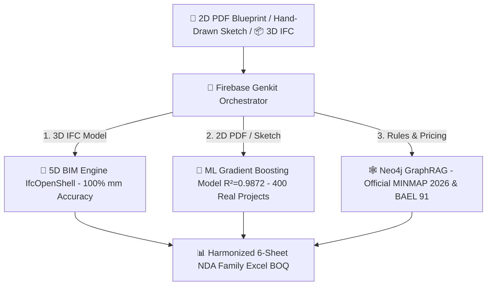

# 🏛️ Archi Cam AI — Sovereign AI Agentic Suite & 5D BIM Engineering Platform

[](https://nextjs.org/)
[](https://www.typescriptlang.org/)
[](https://firebase.google.com/docs/genkit)
[](https://ai.google.dev/gemma)
[](https://mlflow.org/)
[](https://www.python.org/)
[](https://www.docker.com/)
[](https://neo4j.com/)
[](#license)

> **Archi Cam AI** is the sovereign Artificial Intelligence and 5D BIM Engineering platform built specifically for the architecture, quantity surveying, and construction (AEC) industry in Cameroon and across Africa.

---

## 🌟 Core Pillars & Hybrid Dual-Engine Architecture

Archi Cam AI combines **Generative AI** with a **Deterministic Physics & Geometry Engine** to deliver millimeter-accurate Bill of Quantities (BOQ) and photorealistic architectural renders with **Zero Hallucination**:



1. **🤖 Firebase Genkit Agentic Orchestration**: Multi-agent collaboration orchestrating 4 specialized AI agents (`@agent-metreur`, `@agent-devis`, `@agent-structure`, `@agent-design`).
2. **🔮 MLOps Cost Estimation Engine**: Machine learning model trained on **400 real African construction projects** ($R^2 = 0.9872$) providing instant bankable pre-estimates.
3. **🧠 Sovereign Edge LLM (Google Gemma 4 12B QAT)**: Runs 100% offline via LM Studio (`http://127.0.0.1:1234/v1`) to guarantee absolute data privacy and zero API token cost for structural math.
4. **👁️ Multimodal Vision & ControlNet Masking**: **Google Gemini 1.5 Pro/Flash** reads hand-drawn paper sketches, while 3-layer spatial ControlNet locking prevents wall or window hallucinations in **Google Imagen 3.0** renders.
5. **📐 Z-Elevation Auto-Correction**: Automatic 3D physical re-zoning ($Z \in [Z_{\text{min}}, Z_{\text{max}}]$) fixing draftsman layer misallocations from Archicad/Revit models.
6. **📊 Harmonized 6-Sheet NDA Family Excel BOQ**: Millimeter-accurate quantity extraction with $>0.50m^2$ net opening deductions, **Uniclass 2015** classification, and dynamic cross-sheet formulas.

---

## 💻 Tech Stack Overview

### 🤖 Artificial Intelligence & Agentic Framework
- **Agentic Framework**: **Firebase Genkit** (`src/genkit/`) — Multi-agent workflow orchestration.
- **Sovereign Local LLM**: **Google Gemma 4 (12B QAT)** via LM Studio.
- **Multimodal Vision & Rendering**: Google Gemini 1.5 Pro / Flash & Google Imagen 3.0.
- **MLOps Pipeline**: **MLflow** & Scikit-Learn (`scripts/train_cost_predictor.py`).

### 🛠️ Frontend & 3D BIM Visualization
- **Web Framework**: Next.js 14 (App Router), React 18, TypeScript.
- **UI & Styling**: TailwindCSS, Lucide Icons, Radix UI, Framer Motion.
- **3D BIM Viewer**: Three.js & `@thatopen/components` (Web-IFC WebGL in browser).

### ⚙️ Backend, Databases & Infrastructure
- **Deterministic Math Engine**: Python 3.11, IfcOpenShell, Pandas, NumPy, OpenPyXL.
- **Containerized Databases (Docker)**:
  - **Neo4j 5.20 GraphRAG** (Construction Ontology, MINMAP 2026 Price Index, BAEL 91 Standards).
  - **PostgreSQL 16 `pgvector`** (Vector RAG Search).
- **Backend Auth & Storage**: Supabase & Firebase Auth.

---

## 🚀 Quickstart & Local Installation Guide

### Prerequisites
* **Node.js** >= 18.x
* **Python** >= 3.10
* **Docker Desktop** (for Neo4j & PostgreSQL)
* **LM Studio** (for local **Google Gemma 4 12B QAT** model)

### 1. Clone the Repository
```bash
git clone https://github.com/gervais-afk/archi-cam-ai.git
cd archi-cam-ai
```

### 2. Configure LM Studio (Local LLM)
Load the `google/gemma-4-12b-qat` model in LM Studio and start the OpenAI-compatible local server on port `1234`.

### 3. Install Dependencies
```bash
# Frontend dependencies
npm install

# Backend Python dependencies
python -m venv .venv
source .venv/bin/activate  # On Windows: .venv\Scripts\activate
pip install -r requirements.txt
```

### 4. Start Infrastructure & App
```bash
cp .env.example .env.local
docker-compose up -d
npm run dev
```
Open `http://localhost:3000` in your browser.

---

## 🔒 DevSecOps & Security Policy

This repository adheres to enterprise security standards:
* ❌ **Zero Secret Commit**: No API keys, passwords, or JWT tokens are committed to source control (audited via CI/CD).
* 🛡️ **Data Isolation**: Local environment files (`.env.local`), database volumes, logs, and scratch scripts are strictly excluded via `.gitignore`.
* 🇨🇲 **Data Sovereignty**: Local execution via **Gemma 4 (12B QAT)** ensures sensitive financial & architectural plans never leave the local environment.

---

## 📄 License & Intellectual Property

Proprietary License — All Rights Reserved.
Copyright (c) 2026 **Gervais KOA & Archi Cam AI**. All rights reserved.

*Access to this repository is provided solely for technical evaluation purposes for the Google Africa Applied AI Lab selection review.*
