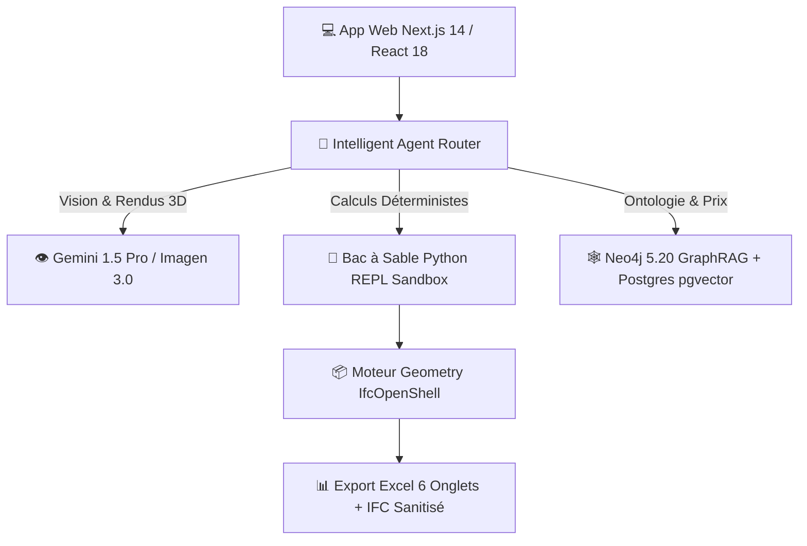

# 🏛️ Archi Cam AI — Plateforme IA & Ingénierie BIM 5D pour le BTP au Cameroun

[](https://nextjs.org/)
[](https://www.typescriptlang.org/)
[](https://www.python.org/)
[](https://www.docker.com/)
[](https://neo4j.com/)
[](https://deepmind.google/technologies/gemini/)
[](#licence)

> **Archi Cam AI** est la toute première suite logicielle souveraine d'Intelligence Artificielle et d'Ingénierie BIM 5D conçue sur mesure pour l'architecture, la métrologie et le secteur du BTP au Cameroun et en Afrique Centrale.

---

## 🌟 Piliers & Innovation Technique

* **📐 Assainissement Altimétrique Z (Anti-Erreurs Archicad)** : Reclassification géométrique 3D automatique des objets mal attribués dans les calques d'implantation par analyse d'altitude $Z$.
* **🖼️ Masquage ControlNet Anti-Hallucination** : Extraction d'un gabarit filaire 2D rigide (murs, portes, fenêtres) interdisant toute distorsion géométrique lors de la génération d'images.
* **🎨 Agent Design & Rendus Photoréalistes (`@agent-design`)** : Génération de visualisations 3D (Google Imagen 3.0) et de plans 2D texturés style Photoshop mariant le modernisme et des touches d'artisanat d'art camerounais (bois d'iroko, motifs bamiléké).
* **📊 Devis Déterministe Excel (Famille NDA - 6 Onglets)** : Extraction déterministe au millimètre près avec déductions nettes des baies $> 0.50\text{ m}^2$, classification **Uniclass 2015** et formules Excel automatiques.
* **🕸️ GraphRAG & Mercuriale MINMAP 2026** : Ontologie Neo4j intégrant les prix mercuriales officiels du Ministère des Marchés Publics et les règles de dimensionnement du béton armé **BAEL 91**.
* **🤖 Moteur REPL Python & Modèle MLOps ($R^2 = 0.9872$)** : Bac à sable Python sécurisé d'exécution mathématique et modèle de prédiction de coûts entraîné sur 400 projets réels BTP au Cameroun.

---

## 🧱 Architecture du Système



---

## 💻 Stack Technologique SOTA

### Frontend & Visualisation 3D
- **Framework** : Next.js 14 (App Router), React 18, TypeScript.
- **Styling & UI** : TailwindCSS, Lucide Icons, Radix UI, Framer Motion.
- **Rendu BIM 3D** : Three.js, `@thatopen/components` (Visualiseur IFC WebGL sur navigateur).

### Backend, IA & Micro-Services
- **IA Multimodale** : Google Gemini 1.5 Pro / Flash (Vision & Raisonnement Spatial).
- **Moteur Photoréaliste** : Google Imagen 3.0.
- **Moteur Déterministe** : Python 3.11, IfcOpenShell, Pandas, NumPy, Scikit-Learn.

### Base de Données & Infra Conteneurisée
- **Docker Compose** : Neo4j 5.20 (GraphRAG / Ontologie BTP) & PostgreSQL 16 `pgvector`.
- **Authentification & Stockage** : Supabase / Firebase Auth.

---

## 🚀 Guide d'Installation & Démarrage Rapide

### Préréquis
* **Node.js** >= 18.x
* **Python** >= 3.10
* **Docker Desktop** (pour Neo4j et PostgreSQL)

### 1. Cloner le Dépôt
```bash
git clone https://github.com/gervais-afk/archi-cam-ai.git
cd archi-cam-ai
```

### 2. Installer les Dépendances Frontend & Backend
```bash
# Dépendances Node.js
npm install

# Dépendances Python (Virtualenv recommandé)
python -m venv .venv
source .venv/bin/activate  # Sur Windows: .venv\Scripts\activate
pip install -r requirements.txt
```

### 3. Configurer les Variables d'Environnement
Copiez le fichier d'exemple et renseignez vos clés d'API :
```bash
cp .env.example .env.local
```

### 4. Lancer les Services Docker (Neo4j & Postgres)
```bash
docker-compose up -d
```

### 5. Démarrer le Serveur de Développement
```bash
npm run dev
```
Rendez-vous sur `http://localhost:3000` pour accéder à l'application.

---

## 🔒 Sécurité & Protection des Données

Ce dépôt respecte les standards professionnels de sécurité :
* ❌ **Aucune clé d'API ou secret n'est commité** dans le code source.
* 🛡️ Les fichiers d'environnement (`.env.local`), logs et scripts d'expérimentation sont strictement isolés par le fichier `.gitignore`.

---

## 📄 Licence & Droits d'Auteur

© 2026 **Archi Cam AI**. Tous droits réservés.
Projet souverain développé pour la modernisation du secteur du BTP au Cameroun.
