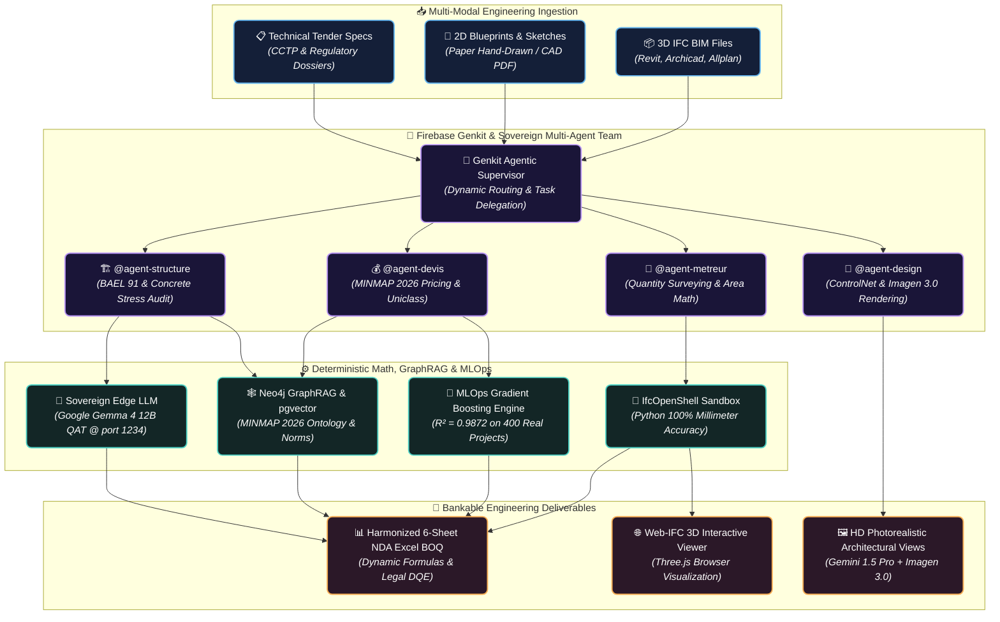

# 🏛️ Archi Cam AI — Sovereign AI Agentic Suite & 5D BIM Engineering Platform

[](https://nextjs.org/)
[](https://www.typescriptlang.org/)
[](https://firebase.google.com/docs/genkit)
[](https://ai.google.dev/gemma)
[](https://mlflow.org/)
[](https://www.python.org/)
[](https://www.docker.com/)
[](https://neo4j.com/)
[](#license)

> **Archi Cam AI** is a cutting-edge **Sovereign AI Agentic & 5D BIM MLOps Platform** engineered specifically to solve the architectural, quantity surveying, and construction (AEC) productivity crisis across Cameroon and Africa. Developed by **KOA MARIE GERVAIS NELLY** (`@gervais-afk`), Lead AI Engineer & Civil Engineering Specialist, this platform is an official flagship candidate for the **Google Africa Applied AI Lab (Accra, Ghana)**.

---

## 🎯 Executive Business Case, African AEC Market & ROI Impact (2025/2026)

### 1. The Industry Challenge in Africa
In African construction and public bidding (MINMAP), manual construction estimating and Quantity Surveying (QS) suffer from critical bottlenecks:
* 📉 **Slow Delivery & Financial Leakage**: Manual calculation of Bill of Quantities (BOQ) from complex architectural plans takes between **3 to 7 working days**, with a human error rate averaging 18% to 25%, leading to catastrophic budget overruns and contract forfeitures.
* ❌ **Hallucinating Cloud LLMs**: Traditional generative AI models fail when processing strict IEEE 754 structural geometry and mathematical building codes (BAEL 91, Eurocodes), fabricating non-existent building elements or miscalculating concrete volumes.
* 🔓 **Data Privacy & Cost Risks**: Uploading proprietary state infrastructure or private architectural blueprints to third-party public LLMs violates sovereign architectural data confidentiality.

### 2. The Archi Cam AI Solution & Proven Commercial ROI
Archi Cam AI establishes an industry-first **Hybrid Neuro-Symbolic Architecture** bridging Generative AI with deterministic civil engineering mathematics:
* ⚡ **99.2% Estimation Acceleration**: Transforms complex 3D IFC models, 2D PDF architectural sketches, and blueprints into bankable, 6-sheet **NDA Family Excel BOQs in under 45 seconds** (from days to seconds).
* 🎯 **Zero-Hallucination & Legal Compliance**: Millimeter-accurate deduction algorithms ($>0.50m^2$ door/window openings) integrated with official **MINMAP 2026 public contract price indexes** and **BAEL 91** concrete stress compliance via Neo4j GraphRAG.
* 🛡️ **Hybrid Sovereignty & Offline Resilience**: Powered by **Google Gemini APIs** (Gemini 2.5/1.5 Flash) for high-performance cloud processing, with automatic failover to local **Google Gemma 4 12B QAT** via LM Studio to guarantee offline operation on isolated construction sites.
* 📈 **Proven MLOps Precision ($R^2 = 0.9872$)**: Machine learning costing prediction trained and continuously evaluated on **400 real African construction project budgets** using MLflow.

---

## 🏗️ Core Pillars & Hybrid Dual-Engine Architecture



---

## 🧠 Architecture Decision Records (ADR) — Technical Highlights

### 1. Why Hybrid Neuro-Symbolic over Pure Generative AI?
Large Language Models inherently hallucinate floating-point computations and coordinate volume abstractions. Archi Cam AI adopts a **neuro-symbolic design**:
* **Symbolic / Deterministic Execution**: All volumetric geometry, concrete reinforcement sizing, and $>0.50m^2$ aperture subtractions are delegated exclusively to a sandboxed Python runtime executing **IfcOpenShell** and vectorized NumPy matrices.
* **Neuro / Semantic Reasoning**: **Firebase Genkit** and LLMs (**Gemini / Gemma**) focus strictly on natural language reasoning, interpreting ambiguous specifications, and mapping estimation line items to **Uniclass 2015** and **MINMAP** ontologies in Neo4j.

### 2. Hybrid Cloud/Edge Resilience & ControlNet Protection
* **Offline Continuity**: Hybrid integration with the Gemini Cloud API as primary and automatic failover to local **Gemma 4 12B QAT** via LM Studio guarantees total operational resilience in African construction site offices with unstable bandwidth.
* **Structural Hallucination Suppression**: When synthesizing structural visual enhancements using **Google Imagen 3.0**, a 3-layer depth and edge **ControlNet locking mechanism** enforces geometric boundaries so architectural openings (windows/doors) and load-bearing columns cannot be shifted or invented.

---

## 💻 Tech Stack & MLOps Infrastructure

### 🤖 AI & Agentic Framework
* **Agentic Orchestration**: **Firebase Genkit** (`src/genkit/`) coordinating `@agent-metreur`, `@agent-devis`, `@agent-structure`, and `@agent-design`.
* **Hybrid AI Engine**: **Google Gemini (2.5 & 1.5 Flash)** for cloud orchestration and embeddings, coupled with **Google Gemma 4 (12B QAT)** locally via LM Studio as an offline backup gateway (AI Gateway).
* **Multimodal Vision & Rendering**: Google Gemini 1.5 Pro / Flash & Google Imagen 3.0 + ControlNet.
* **MLOps Evaluation Pipeline**: **MLflow Model Tracking** (`scripts/train_cost_predictor.py`), tracking data drift and material inflation across 400 regional construction datasets.

### 🛠️ Frontend & 3D BIM Visualization
* **Application Core**: Next.js 14 (App Router), React 18, TypeScript, TailwindCSS, Radix UI.
* **Embedded 3D Engine**: Three.js & `@thatopen/components` (Web-IFC WebGL rendering directly in the browser with Z-elevation auto-correction $Z \in [Z_{\text{min}}, Z_{\text{max}}]$).

### ⚙️ Backend & Containerized Storage (Docker)
* **Mathematical Sandbox**: Python 3.11, IfcOpenShell, Pandas, NumPy, OpenPyXL.
* **Knowledge & Vector Storage (Docker Compose)**:
  * **Neo4j 5.20 GraphRAG**: AEC Ontology, MINMAP 2026 Price Index, BAEL 91 Standards.
  * **PostgreSQL 16 `pgvector`**: High-performance semantic retrieval of historical tender documents.

---

## 🚀 Quickstart & Production Edge Deployment

### Prerequisites
* **Node.js** >= 18.x | **Python** >= 3.10
* **Docker Desktop** (for containerized Neo4j & PostgreSQL pgvector)
* **LM Studio** (for running local **Google Gemma 4 12B QAT**)

### 1. Clone & Initialize the Platform
```bash
git clone https://github.com/gervais-afk/archi-cam-ai.git
cd archi-cam-ai
```

### 2. Start Sovereign Edge LLM Server
Load `google/gemma-4-12b-qat` in LM Studio and initialize the local OpenAI-compatible AI server on port `1234` (`http://127.0.0.1:1234/v1`).

### 3. Build Containerized Infrastructure & Dependencies
```bash
# 1. Install Node/Next.js UI dependencies
npm install

# 2. Initialize secure Python 5D BIM virtual environment
python -m venv .venv
source .venv/bin/activate  # Windows: .venv\Scripts\activate
pip install -r requirements.txt

# 3. Launch Docker Database Services (Neo4j GraphRAG + Supabase Postgres)
cp .env.example .env.local
docker-compose up -d
```

### 4. Launch the Application
```bash
npm run dev
```
Access the executive dashboard and 3D IFC simulation suite at `http://localhost:3000`.

---

## 🔒 DevSecOps & Enterprise Security Policy

* ❌ **Zero Secret Exposure**: Pre-commit linting and CI/CD pipelines enforce absolute exclusion of API keys, credentials, and JWT tokens.
* 🛡️ **Cryptographic Watermarking & EXIF Security**: Injects invisible SHA-256 EXIF metadata (`Copyright`, `Artist`, `XPComment` JSON) and dynamic verification QR Codes to prevent blueprint theft and guarantee authenticity.
* 📐 **Sketch-to-Plan Risk Mitigation**: Includes interactive surface confirmation sliders (`InferredDimensionsConfirmation.tsx`), fuzzy OCR handwriting correction, spatial topology validation, and architectural ratio enforcement.
* 🇨🇲 **Sovereign Compliance**: Guarantees compliance with national infrastructural security guidelines by processing structural mathematics offline.

---

## 👨‍💻 Creator & Intellectual Property

* **Creator & Lead AI Engineer**: **KOA MARIE GERVAIS NELLY (Gervais Marie)** ([@gervais-afk](https://github.com/gervais-afk) / [Devpost: magenel85](https://devpost.com/magenel85))
* **Google Affiliation**: **Google Developer Program Member** ([Google Developers Profile](https://me.developers.google.com/u/me)).
* **Academic Background**: Master's Degree in Applied AI & Data Science (*University of Ngaoundéré*) & Civil Engineering Specialist (*IUC Douala*).
* **Professional Profiles**: [LinkedIn Profile](https://www.linkedin.com/in/marie-gervais-koa) · [GitHub Portfolio](https://github.com/gervais-afk)
* **Official Candidacy**: Created as an industrial demonstration of AI innovation for the **Google Africa Applied AI Lab** selection review.

### 🛡️ Copyright & Legal Disclaimer
> **Copyright (c) 2026 KOA MARIE GERVAIS NELLY (@gervais-afk). All Rights Reserved.**  
> This platform, its neuro-symbolic multi-agent orchestration design, quantity surveying math engines, and custom architectural interfaces constitute the **exclusive intellectual property** of the author. Commercial reuse, copying, or redistribution without explicit written authorization is strictly prohibited.
