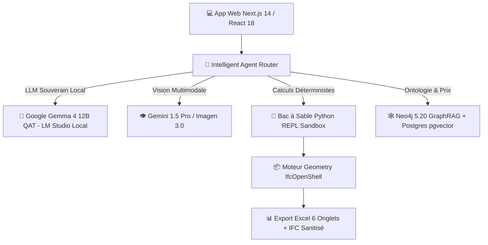

# 🏛️ Archi Cam AI — Plateforme IA & Ingénierie BIM 5D pour le BTP au Cameroun

[](https://nextjs.org/)
[](https://www.typescriptlang.org/)
[](https://ai.google.dev/gemma)
[](https://www.python.org/)
[](https://www.docker.com/)
[](https://neo4j.com/)
[](#licence)

> **Archi Cam AI** est la toute première suite logicielle souveraine d'Intelligence Artificielle et d'Ingénierie BIM 5D conçue sur mesure pour l'architecture, la métrologie et le secteur du BTP au Cameroun et en Afrique Centrale.

---

## 🌟 Piliers & Innovation Technique

* **🤖 LLM Hybride & Souveraineté (Gemma 4 12B QAT & Gemini 1.5)** : Utilisation locale du modèle **Google Gemma 4 (12B QAT)** via LM Studio pour un raisonnement et une confidentialité 100% hors-ligne des données de chantier, combinée à **Gemini 1.5 Pro/Flash** pour la vision multimodale.
* **📐 Assainissement Altimétrique Z (Anti-Erreurs Archicad)** : Reclassification géométrique 3D automatique des objets mal attribués dans les calques d'implantation par analyse d'altitude $Z$.
* **🖼️ Masquage ControlNet Anti-Hallucination** : Extraction d'un gabarit filaire 2D rigide (murs, portes, fenêtres) interdisant toute distorsion géométrique lors de la génération d'images.
* **🎨 Agent Design & Rendus Photoréalistes (`@agent-design`)** : Génération de visualisations 3D (Google Imagen 3.0) et de plans 2D texturés style Photoshop mariant le modernisme et des touches d'artisanat d'art camerounais (bois d'iroko, motifs bamiléké).
* **📊 Devis Déterministe Excel (Famille NDA - 6 Onglets)** : Extraction déterministe au millimètre près avec déductions nettes des baies $> 0.50\text{ m}^2$, classification **Uniclass 2015** et formules Excel automatiques.
* **🕸️ GraphRAG & Mercuriale MINMAP 2026** : Ontologie Neo4j intégrant les prix mercuriales officiels du Ministère des Marchés Publics et les règles de dimensionnement du béton armé **BAEL 91**.
* **🤖 Moteur REPL Python & Modèle MLOps ($R^2 = 0.9872$)** : Bac à sable Python sécurisé d'exécution mathématique et modèle de prédiction de coûts entraîné sur 400 projets réels BTP au Cameroun.

---

## 🧱 Architecture du Système



---

## 💻 Stack Technologique SOTA

### Intelligence Artificielle & LLM Hybride
- **LLM Local Souverain** : **Google Gemma 4 (12B QAT)** via LM Studio (`http://127.0.0.1:1234/v1`) — Garantit la confidentialité absolue des données financières et techniques des projets BTP.
- **Vision Multimodale & Photoréalisme** : Google Gemini 1.5 Pro / Flash & Google Imagen 3.0.
- **Moteur Agentic Router** : Routage intelligent des requêtes vers `@agent-metreur`, `@agent-devis`, `@agent-structure`, `@agent-design`.

### Frontend & Visualisation 3D
- **Framework** : Next.js 14 (App Router), React 18, TypeScript.
- **Styling & UI** : TailwindCSS, Lucide Icons, Radix UI, Framer Motion.
- **Rendu BIM 3D** : Three.js, `@thatopen/components` (Visualiseur IFC WebGL sur navigateur).

### Backend, Calculs & Base de Données
- **Calculs Déterministes** : Python 3.11, IfcOpenShell, Pandas, NumPy, Scikit-Learn.
- **Docker Compose** : Neo4j 5.20 (GraphRAG / Ontologie BTP) & PostgreSQL 16 `pgvector`.
- **Authentification & Stockage** : Supabase / Firebase Auth.

---

## 🚀 Guide d'Installation & Démarrage Rapide

### Préréquis
* **Node.js** >= 18.x
* **Python** >= 3.10
* **Docker Desktop** (pour Neo4j et Postgres)
* **LM Studio** (pour faire tourner le modèle local **Google Gemma 4 12B QAT**)

### 1. Cloner le Dépôt
```bash
git clone https://github.com/gervais-afk/archi-cam-ai.git
cd archi-cam-ai
```

### 2. Configurer le Modèle Local (LM Studio)
Chargez le modèle `google/gemma-4-12b-qat` dans LM Studio et démarrez le serveur local OpenAI-compatible sur le port `1234`.

### 3. Installer les Dépendances Frontend & Backend
```bash
# Dépendances Node.js
npm install

# Dépendances Python
python -m venv .venv
source .venv/bin/activate  # Sur Windows: .venv\Scripts\activate
pip install -r requirements.txt
```

### 4. Démarrer les Services & l'Application
```bash
cp .env.example .env.local
docker-compose up -d
npm run dev
```

---

## 🔒 Sécurité & Protection des Données (DevSecOps)

Ce dépôt respecte les exigences strictes de sécurité et de conformité logicielle :
* ❌ **Zero Secret Commit** : Aucune clé d'API, mot de passe ou jeton de service n'est commité dans le code source.
* 🛡️ **Isolation des Données** : Les fichiers de configuration (`.env.local`), bases de données locales, logs et scripts d'expérimentation sont strictement exclus via `.gitignore`.
* 🇨🇲 **Souveraineté des Données BTP** : Le traitement local par **Gemma 4 (12B QAT)** permet d'analyser les projets sensibles sans fuite de données vers des serveurs tiers.

---

## 📄 Licence & Droits d'Auteur

Proprietary License — All Rights Reserved.
Copyright (c) 2026 **Gervais KOA & Archi Cam AI**. Tous droits réservés.
