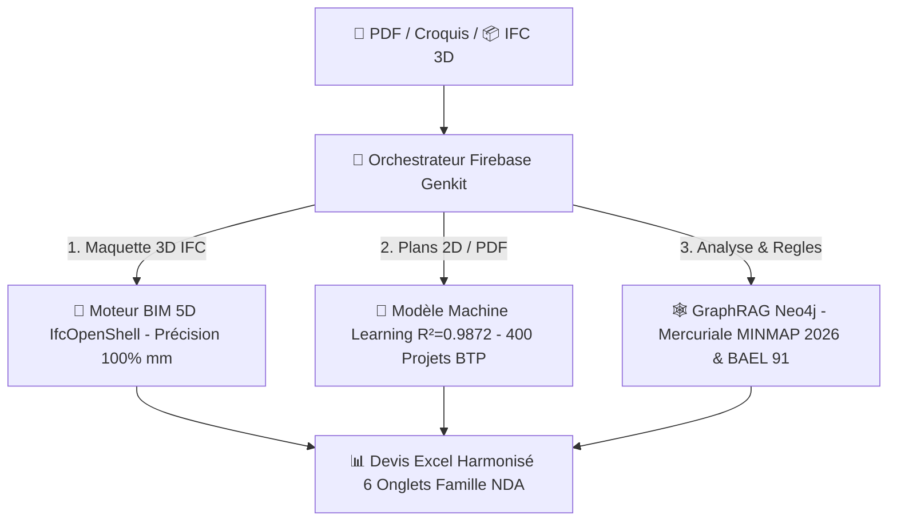

# 🏛️ Archi Cam AI — Suite IA Agentique & Ingénierie BIM 5D (BTP Cameroun)

[](https://nextjs.org/)
[](https://www.typescriptlang.org/)
[](https://firebase.google.com/docs/genkit)
[](https://ai.google.dev/gemma)
[](https://mlflow.org/)
[](https://www.python.org/)
[](https://www.docker.com/)
[](https://neo4j.com/)
[](#licence)

> **Archi Cam AI** est la suite logicielle souveraine d'Intelligence Artificielle Agentique et d'Ingénierie BIM 5D conçue pour le secteur du BTP au Cameroun et en Afrique Centrale.

---

## 🌟 Piliers & Moteur de Devis Hybride (Tri-Moteur)

Archi Cam AI combine 3 technologies complémentaires pour générer des devis déterministes et estimatifs d'une précision inégalée :



1. **🤖 Orchestration Agentique Firebase Genkit** : Pilotage de 4 agents IA spécialisés (`@agent-metreur`, `@agent-devis`, `@agent-structure`, `@agent-design`) collaborant en parallèle.
2. **🔮 MLOps & Machine Learning (MLflow Pipeline)** : Pré-devis estimatif instantané alimenté par un modèle Gradient Boosting ($R^2 = 0.9872$) entraîné sur 400 projets réels de construction au Cameroun.
3. **🧠 LLM Hybride & Souveraineté (Gemma 4 12B QAT & Gemini 1.5)** : Modèle **Google Gemma 4 (12B QAT)** local via LM Studio pour le traitement ultra-confidentiel hors-ligne, couplé à **Gemini 1.5 Pro** (Vision) et **Imagen 3.0** (Rendus 3D).
4. **📐 Assainissement Altimétrique Z & ControlNet** : Correcteur automatique des calques Archicad par altitude $Z$ et masque filaire rigide anti-hallucination.
5. **📊 Devis Excel Harmonisé (Famille NDA - 6 Onglets)** : Export `.xlsx` complet avec formules automatiques reliées (Fondation, RDC, Étage, Second Œuvre, Récapitulatif DEVIS, Planning GANTT CPM/PERT).

---

## 💻 Stack Technologique Complète

### 🤖 Intelligence Artificielle & Framework Agentique
- **Framework Agentique** : **Firebase Genkit** (`src/genkit/`) — Orchestration multi-agents type Crew.
- **LLM Local Souverain** : **Google Gemma 4 (12B QAT)** via LM Studio (`http://127.0.0.1:1234/v1`).
- **Vision & Photoréalisme** : Google Gemini 1.5 Pro / Flash & Google Imagen 3.0.
- **MLOps & Pipeline ML** : **MLflow** & Scikit-Learn (`scripts/train_cost_predictor.py`).

### 🛠️ Frontend & Visualisation 3D BIM
- **Frontend Framework** : Next.js 14 (App Router), React 18, TypeScript.
- **Styling & UI** : TailwindCSS, Lucide Icons, Radix UI, Framer Motion.
- **Visualiseur 3D BIM** : Three.js & `@thatopen/components` (Web-IFC WebGL).

### ⚙️ Backend, Bases de Données & Infra
- **Calculs Déterministes BIM** : Python 3.11, IfcOpenShell, Pandas, NumPy, OpenPyXL.
- **Bases de Données Conteneurisées (Docker)** :
  - **Neo4j 5.20 GraphRAG** (Ontologie BTP, Mercuriale MINMAP 2026, BAEL 91).
  - **PostgreSQL 16 `pgvector`** (Recherche documentaire vectorielle).
- **Backend Storage & Auth** : Supabase & Firebase Auth.

---

## 🚀 Démarrage Rapide

### 1. Cloner & Installer
```bash
git clone https://github.com/gervais-afk/archi-cam-ai.git
cd archi-cam-ai
npm install
pip install -r requirements.txt
```

### 2. Démarrer les Services
```bash
cp .env.example .env.local
docker-compose up -d
npm run dev
```

---

## 🔒 Sécurité & Protection (DevSecOps)

* ❌ **Zero Secret Commit** : Aucune clé d'API commité (vérifié par audit CI/CD).
* 🛡️ **Isolation des Données** : `.env.local`, logs et scripts temporaires strictement ignorés par `.gitignore`.
* 🇨🇲 **Souveraineté des Données** : Exécution locale par **Gemma 4 (12B QAT)** pour préserver la confidentialité des projets.

---

## 📄 Licence

Proprietary License — All Rights Reserved.
Copyright (c) 2026 **Gervais KOA & Archi Cam AI**. Tous droits réservés.
