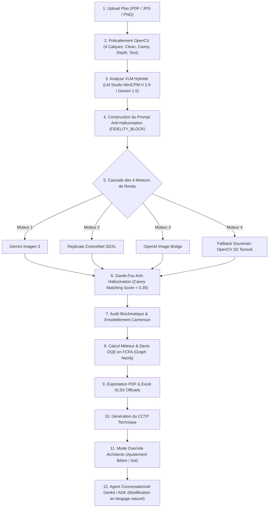

# 🚀 ROADMAP TEST MINICPM-V 2.6 & RÉCAPITULATIF ARCHI CAM AI DE A À Z

---

## 📅 PARTIE 1 : ROADMAP DE TEST POUR DEMAIN (LM STUDIO + MINICPM-V 2.6)

### 1. Configuration de l'environnement LM Studio
* [ ] **Téléchargement du Modèle** : Dans LM Studio, rechercher `bartowski/MiniCPM-V-2_6-GGUF` et télécharger la quantification `q4_k_m` (~4.5 Go).
* [ ] **Configuration du Serveur** :
  - Démarrer le serveur LM Studio sur le port `:1234`.
  - Charger le modèle `MiniCPM-V 2.6`.
  - Définir le preset de prompt sur **ChatML** (`<|im_start|>user`).
  - Activer l'accélération GPU (VRAM Offload max).

### 2. Protocole de Validation sur les 4 Types de Plans
Lancer un rendu sur `http://localhost:3000/dashboard/particulier` pour chacun des 4 types de fichiers suivants :

| N° | Fichier Test | Type | Objectif de Validation |
|---|---|---|---|
| 1 | `plan_test_simple.pdf` | Vectoriel PDF | Validation conversion rapide PDF -> PNG & Analyse VLM < 4s |
| 2 | `plan_scan.jpg` | Scan Papier HD | Détection nette des pièces & cotations |
| 3 | `plan_stylo.jpg` | Croquis à main levée | Robustesse OpenCV + Binarisation binaire |
| 4 | `plan_photo_smartphone.jpg` | Photo Smartphone avec ombre | Correction EXIF & Redressement automatique |

### 3. Matrice des Vérifications Techniques (KPIs)
Pour chaque rendu généré, vérifier :
1. **Temps de Réponse VLM** : L'analyse visuelle MiniCPM-V 2.6 doit répondre en **< 5 secondes** (visible dans les logs `[LM Studio Vision]`).
2. **Comparateur Avant / Après** :
   - **À Gauche (AVANT)** : Affiche le plan brut d'origine (`_clean_plan.png`).
   - **À Droite (APRÈS)** : Affiche le plan 2D habillé / Rendu 3D (`plan_rendered_...png`).
3. **Badge de Fidélité Anti-Hallucination** :
   - Le badge affiche **🔒 100% Géométrie** (Moteur OpenCV) ou **✅ AI Conforme** (Score Canny < 0.35).
4. **Calcul du Devis FCFA & Métreur BTP** :
   - Le tableau DQE calcule automatiquement le prix global du projet en FCFA avec les ratios Gros Œuvre, Revêtements et Bois local.

---

## 🏛️ PARTIE 2 : RÉCAPITULATIF COMPLET DU SYSTÈME ARCHI CAM AI (DE A À Z)

### 🌟 1. Concept & Proposition de Valeur
**Archi Cam AI** est le premier système d'intelligence artificielle architecturale et BTP souverain d'Afrique Centrale.  
Il transforme n'importe quel plan (PDF, photo smartphone, croquis) en :
1. **Plan 2D Photoshop Habillé & Rendu 3D Photoréaliste** adapté aux styles africains (Luxe Tropical, Contemporain Iroko, Sahel Éco-Bioclimatique).
2. **Devis Quantitatif Estimatif (DQE) en FCFA** (Normes BAEL 91 & Prix locaux du Cameroun).
3. **Dossier Technique & Note Bioclimatique** (Albédo, orientation solaire, contrainte de sol).

---

### 🔄 2. Architecture Technique des 12 Étapes du Pipeline

---

### 📂 3. Cartographie des Fichiers Maîtres du Codebase

* 🌐 **Routes API & Orchestration** :
  - `app/api/render/image/route.ts` : Pipeline principal exécutant la cascade des moteurs et la validation anti-hallucination.
  - `lib/lm-studio-analyzer.ts` : Connecteur local VLM ultra-rapide avec Sharp (1024px) et timeout à 120s.
  - `fastmcp/main.py` : Serveur FastMCP (port :8000) exposant les microservices Python OpenCV et Graph Neo4j.

* 👁️ **Computer Vision & Anti-Hallucination** :
  - `scripts/generate_photoshop_2d_plan.py` : Moteur OpenCV 2D assemblant les textures (parquet, pavés), le mobilier et le cartouche.
  - `scripts/adaptive_plan_detector.py` : Prétraitement universel gérant 8 types de dégradations de plans (PDF, EXIF, ombres).
  - `scripts/hallucination_detector.py` : Calcul du score de correspondance de contours Canny ($\text{Score} < 0.35$).

* 🎨 **Interface Utilisateur & UX** :
  - `app/dashboard/particulier/page.tsx` : Espace client B2C pour le téléversement et le suivi de génération.
  - `components/PlanComparisonSlider.tsx` : Comparateur interactif Avant (Plan brut) / Après (Plan rendu 2D/3D).
  - `components/render/FidelityBadge.tsx` : Badge garantissant 0% hallucination à l'utilisateur.

---

### 🔐 4. Règles d'Or de l'Architecture Archi Cam AI
1. **0% Bloquant** : Si internet est coupé ou si les clés API cloud échouent, le Moteur 4 (OpenCV local) prend le relais en **< 5s**.
2. **0% Hallucination** : Tout rendu IA dont la structure s'écarte du plan d'origine est automatiquement rejeté.
3. **Souveraineté des Données** : Les données de métré et devis en FCFA sont calculées localement.

---
*Fichier créé le 03 Août 2026 pour le projet Archi Cam AI.*
