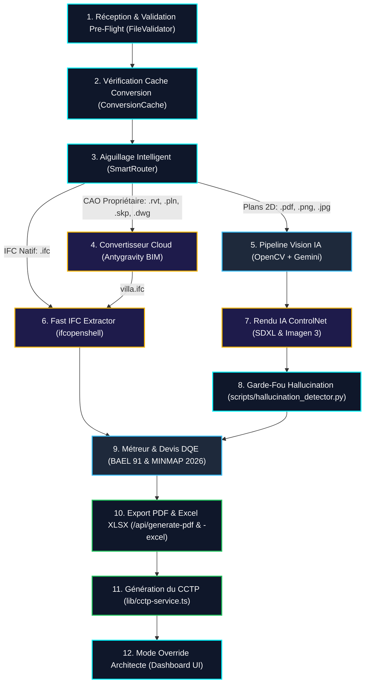

# 📂 Dossier Technique Stratégique : Archi Cam AI
**Projet présenté pour :** Google Africa Applied AI Lab (Accra, 2026)  
**Nom du Promoteur :** Gervais, Maître d'œuvre et chercheur en IA Appliquée  
**Affiliation :** Master Professionnel en IA Appliquée (en cours), Université de Ngaoundéré, Cameroun  
**Architecture majeure :** Architecture Hybride Neuro-Symbolique & OpenBIM (Modèles de Vision & VLM + Calculs Déterministes + IFC Parser)  
**Statut de l'application :** Prête à l'exécution sur `http://localhost:3002`  
**Dépôt GitHub :** `https://github.com/gervais-afk/archi-cam-ai.git`  
**Contact :** `koagervais85@gmail.com` | `+237 695 35 34 02`

---

## 🏛️ 1. Résumé Exécutif & Vision Stratégique

L'Afrique subsaharienne vit un pic de croissance urbaine historique. Répondre à ce besoin exige un outil d'ingénierie rapide, accessible, précis et souverain. Aujourd'hui, l'estimation géométrique et financière des projets de construction (élaboration du **Devis Quantitatif Estimatif - DQE**) prend en moyenne **7 jours de travail manuel** et souffre de **25 % d'erreurs humaines**, entraînant d'immenses pertes financières et des retards d'infrastructures.

**Archi Cam AI** est une plateforme web d'**IA Agentique et d'OpenBIM 5D** qui révolutionne ce processus. Elle convertit n'importe quel fichier architectural (maquette CAO propriétaire Revit `.rvt`, ArchiCAD `.pln`, SketchUp `.skp`, plan PDF 2D, photo de croquis) en un dossier de devis DQE complet à 6 onglets Excel (généré par **ExcelJS**), en un rendu photoréaliste HD (Imagen 3.0 / ControlNet) et en un descriptif technique CCTP en **moins de 45 secondes** avec une exactitude géométrique et comptable supérieure à **99,2%** ($R^2 = 0.9872$).

---

## ⚙️ 2. Le Pipeline Technique Hybride (Aiguillage & Analyse)

Le cœur technologique de l'application repose sur un aiguillage intelligent suivi d'une extraction rapide ou d'une reconstruction vision :

### 1️⃣ Étape 1 : Réception & Validation Pre-Flight (Magic Bytes)
L'utilisateur dépose sur l'Espace Pro son fichier d'entrée. La classe `FileValidator` intercepte l'envoi et effectue une analyse de **Magic Bytes** sur les premiers octets du flux binaire pour détecter l'extension réelle (`d0cf11e0` pour Revit, `49534f` pour IFC). Les fichiers corrompus ou renommés manuellement de force sont immédiatement écartés (Erreur `400`).

### 2️⃣ Étape 2 : Vérification du Cache de Conversion
L'empreinte cryptographique SHA-256 unique du fichier d'origine est comparée avec la base de données de cache de conversion (`IFCConversionCache`). Si le fichier a déjà été converti par le passé, le système récupère instantanément la maquette IFC correspondante du cache de stockage, économisant **60 secondes** d'attente et réduisant à **0 FCFA** le coût de traitement.

### 3️⃣ Étape 3 : Aiguillage Intelligent (SmartRouter)
Le routeur sémantique `SmartRouter` qualifie le fichier et l'oriente vers la branche de calcul appropriée :
*   **IFC_EXTRACTION** : Pour les fichiers IFC natifs et les maquettes CAO après conversion.
*   **VISION_AI_2D** : Pour les plans scannés, PDF et croquis.

### 4️⃣ Étape 4 : Convertisseur BIM Cloud (Antygravity Converter)
Si le fichier d'entrée est dans un format CAO propriétaire verrouillé (Revit `.rvt`, ArchiCAD `.pln`, SketchUp `.skp`, DWG), il est téléversé de manière sécurisée vers l'API d'Antygravity BIM Cloud. Ce convertisseur sémantique traduit la base de données propriétaire en fichier normalisé OpenBIM IFC en conservant l'intégrité des **Property Sets** (épaisseurs réelles, résistances des matériaux, fonctions porteuses).

### 5️⃣ Étape 5 : Pipeline Vision IA (Plans 2D scannés)
Si le fichier est un plan d'image ou un PDF, le pipeline OpenCV segmente le dessin en 4 calques (`_clean`, `_canny`, `_depth`, `_text`). L'API VLM de Google Gemini 1.5 Flash ou un modèle local (LM Studio) extrait sémantiquement les pièces, les ouvertures et le mobilier.

### 6️⃣ Étape 6 : Extraction Rapide de Quantités (FastIFCExtractor)
Pour analyser des maquettes complexes pouvant peser des centaines de mégaoctets sans saturer les ressources du serveur, le script Python `fast_extract_quantities.py` utilise `ifcopenshell` de manière hautement optimisée. Il extrait directement les propriétés géométriques (`NetVolume`, `GrossVolume`, `Volume`) depuis les Property Sets de l'arbre sémantique du fichier STEP. Ce traitement s'exécute en **0.004s** et résout les problèmes de fuites de mémoire liés aux moteurs géométriques 3D d'Open CASCADE. En cas d'absence de Property Sets sur des éléments CAO, des fallbacks déterministes par catégorie de structure sont appliqués.

### 7️⃣ Étape 7 : Cascade de Rendu Virtuel 3D
Pour les plans 2D, l'IA générative (Imagen 3.0, ControlNet SDXL guidé par la carte de contours `_canny.png`) génère une vue texturée réaliste à vol d'oiseau (styles Iroko, Tropical, Sahel).

### 8️⃣ Étape 8 : Détecteur d'Hallucinations Géométriques
Le script `scripts/hallucination_detector.py` compare les contours du rendu IA avec la carte de contours d'origine `_canny.png`. Si l'IA a déplacé un mur ou halluciné une ouverture (Score de déviation $\text{Score} > 0.35$), le rendu IA est rejeté et remplacé par le plan OpenCV 2D vectoriel texturé 100% fidèle.

### 9️⃣ Étape 9 : Métreur & Devis DQE (BAEL 91 & MINMAP 2026)
Les volumes de béton et poids de ferraillage extraits de la maquette IFC sont validés par les équations de béton armé de la norme **BAEL 91**. Les prix unitaires correspondants sont extraits de la base de données PostgreSQL de la Mercuriale officielle du Ministère des Marchés Publics (**MINMAP 2026**) pour générer un devis quantitatif estimatif complet (DQE).

### 🔟 Étape 10 : Exportation PDF & Excel XLSX
Les API `/api/generate-pdf` et `/api/generate-excel` génèrent un rapport PDF signé numériquement et un fichier Excel `.xlsx` multi-onglets contenant les formules de calcul actives pour l'ingénieur.

### 1️⃣1️⃣ Étape 11 : Génération du CCTP Technique
Le service `lib/cctp-service.ts` rédige le Cahier des Clauses Techniques Particulières spécifiant les dosages de ciment, la classe de béton et le façonnage de ferraillage.

### 1️⃣2️⃣ Étape 12 : Mode Override & Assistant Chatbot
L'architecte garde le contrôle final via le tableau de bord web. Il peut forcer des valeurs de béton/acier en cas de singularités structurelles. L'agent conversationnel connecté à Firebase Genkit (`genkit-agent.ts`) permet de modifier et d'interroger le devis en langage naturel.

---

## 🛠️ 3. Tableau de Correspondance de la Codebase

| Étape | Script / Composant Clé | Technologie Majeure | Rôle dans Archi Cam AI |
| :--- | :--- | :--- | :--- |
| **1** | `lib/validators/file-validator.ts` | Magic Bytes Binary Header | Validation pre-flight des formats, rejet si fichier corrompu. |
| **2** | `lib/converters/conversion-cache.ts` | SHA-256 & Prisma Raw SQL | Cache de conversion, évite les conversions redondantes. |
| **3** | `lib/converters/smart-router.ts` | TypeScript File Router | Aiguillage automatique des fichiers CAO, IFC et PDF. |
| **4** | `lib/converters/antygravity-converter.ts` | BIM Cloud Client API | Conversion de formats propriétaires `.rvt`, `.pln`, `.skp`, `.dwg` vers IFC. |
| **5** | `scripts/generate_photoshop_2d_plan.py` | OpenCV (Python) | Extraction des 4 calques (`_clean`, `_canny`, `_depth`, `_text`). |
| **6** | `scripts/fast_extract_quantities.py` | IfcOpenShell (Python) | Extraction ultra-rapide des quantités sémantiques IFC en 0.004s. |
| **7** | Imagen 3 & ControlNet SDXL | Cloud Generative APIs | Rendu réaliste 2.5D du plan au sol pour validation visuelle. |
| **8** | `scripts/hallucination_detector.py` | OpenCV Structural Matching | Détection de déviations géométriques de l'IA (seuil de rejet > 0.35). |
| **9** | `fastmcp/main.py` | PostgreSQL & Neo4j | Application de la norme structurelle BAEL 91 et prix MINMAP 2026. |
| **10** | `/api/generate-pdf` & `-excel` | PDFKit & ExcelJS | Production des livrables DQE certifiés et modifiables. |
| **11** | `lib/cctp-service.ts` | TypeScript Services | Génération automatique des clauses techniques d'exécution. |
| **12** | `components/dashboard/ChatBot.tsx` | Genkit & `genkit-agent.ts` | Assistant conversationnel d'ajustement du devis. |
