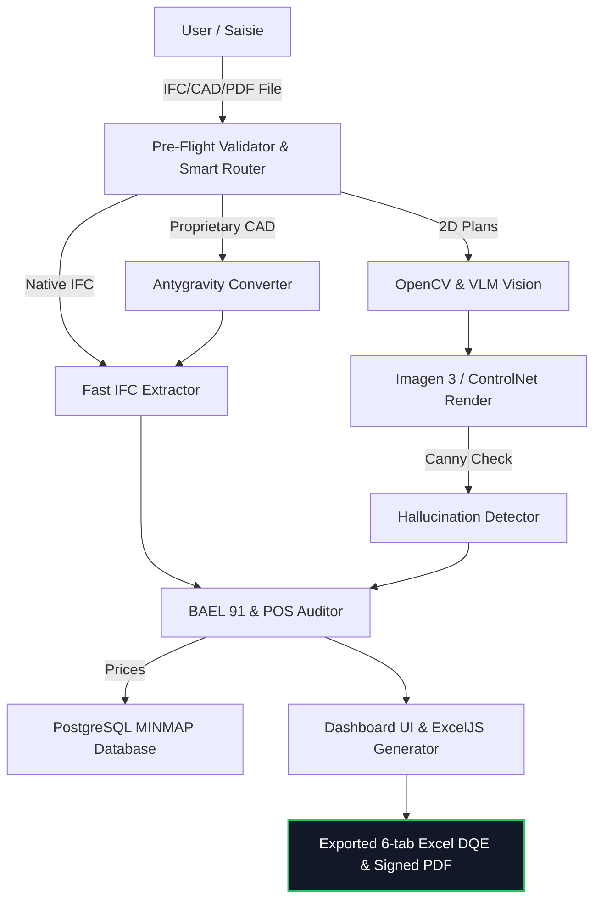

# 📊 Archi Cam AI: Strategic Pitch Deck (Google Slides)
**Event:** Google Africa Applied AI Lab Presentation (Accra, 2026)  
**Visual Theme:** Deep Slate (`#0F172A`) | Electric Neon Blue (`#00F2FE`) | Google Accent Colors  
**Design Guideline:** Zero paragraphs. High density of giant numbers, structured bullet lists, and visual mockups.

---

<!-- SLIDE 1 -->
## 🎬 Slide 1: Cover Page
### **ARCHI CAM AI**
#### *Universal OpenBIM, Hybrid Vision & Sovereign Agentic 5D Platform for African Construction*

```
                     ┌──────────────────────────────┐
                     │ [ 🌐 github.com/gervais-afk ]│
                     └──────────────────────────────┘
```

*   **🏆 Accra Lab Badge:** `[ Google Africa Applied AI Lab — Accra 2026 Cohort ]`
*   **💡 Core Value Prop:** Converting 3D CAD models (Revit, ArchiCAD, SketchUp), 2D PDFs, or paper sketches into bankable 6-tab Excel DQEs and compliance audits in **45 seconds** instead of **7 days**.
*   **🎨 Visual Guideline:** Dark slate theme with a glowing electric-blue 3D structural model being mapped out by neon vector nodes.

---

<!-- SLIDE 2 -->
## 🚨 Slide 2: The African Construction Bottleneck
### **The Problem: Structural Inefficiencies Stalling Growth**

```
  ┌─────────────────────────────────────────────────────────────┐
  │                                                             │
  │     7 DAYS                   25%                  $120B     │
  │  Manual Takeoff        Average Quantity      Annual African │
  │   & Estimation           Errors (DQE)      Infra Funding Gap│
  │                                                             │
  └─────────────────────────────────────────────────────────────┘
```

*   **⚠️ Proprietary Locks:** Local architectural firms use locked formats (.rvt, .pln) and lack resources to export clean sémantiques IFC.
*   **⚠️ Heavy Calculations:** Standard open-source BIM tools parse 3D geometries by rendering shapes, crashing servers under high loads (50MB+).
*   **⚠️ Financial Bleeding:** Takeoff errors result in material wastage, structural failure (e.g. Cameroonian building collapses), and prolonged disputes.

---

<!-- SLIDE 3 -->
## 🚀 Slide 3: The Archi Cam AI Disruption
### **The Solution: Universal Hybrid BIM & 2D Plan AI Engine**

*   **📍 Phase 1: Site Geolocation & Feasibility:**
    *   Interactive map search to pin the construction parcel.
    *   Autonomous GPS, elevation, flood-risk, and local POS zoning regulations checks.
*   **⚡ Sovereign Web BIM Core:** Lightweight 3D IFC viewer running at 60 FPS in-browser.
*   **📉 Zero Hallucination Math:** Separating generative reasoning from mathematical coordinate analysis to achieve absolute precision ($R^2=0.9872$).

---

<!-- SLIDE 4 -->
## 👤 Slide 4: Personalized Services (Three Service Levels)
### **Tailored Features & CamPay Mobile Money Monetization**

*   **🏠 A. Auto-Constructeur (Free Tool):**
    *   **Budget & Material Tracker:** Instant macro concrete and local materials pricing (Cimencam/Dangote).
    *   **CamPay Mobile Money:** USSD push triggers (`*126#` / `#150#`) for MTN MoMo and Orange Money starting at **2,500 FCFA**.
*   **📐 B. Professional Architects & Engineers (Pro Tier):**
    *   **CAD/BIM Universal Router:** Converts Revit `.rvt`, ArchiCAD `.pln`, SketchUp `.skp` to high-fidelity IFC.
    *   **Imagen 3.0 & FAL.ai Luma Video:** Photorealistic renders and 4K drone flythroughs.
*   **🏢 C. Construction Enterprises & Government B2B (Enterprise Tier):**
    *   **ISO 19650 CDE & BIM Audits:** Automated LOD/LOI checks and audit trails.

---

<!-- SLIDE 5 -->
## 📥 Slide 5: Stage 1, 2 & 3: Input, Validation & Routing
### **Pre-Flight Validation & Smart File Routing**

*   **⚙️ Stage 1: Pre-Flight Binary Checks (`FileValidator`):**
    *   Detects file signature **Magic Bytes** (`d0cf11e0` for Revit, `49534f` for IFC) to reject corrupt uploads instantly.
*   **💾 Stage 2: SHA-256 Conversion Caching (`ConversionCache`):**
    *   Compares the file hash. If already converted, skips the conversion process completely (**saves 60s & $0.008 API credits**).
*   **🧠 Stage 3: Smart File Routing (`SmartRouter`):**
    *   Routes native `.ifc` directly, proprietary CAD to cloud converters, and `.pdf`/`.png` to the Vision AI pipeline.

---

<!-- SLIDE 6 -->
## 🎨 Slide 6: Stage 4, 5 & 6: Conversions & Fast Quantity Extraction
### **Semantic CAD Conversions & 0.004s Fast Python Extractor**

*   **☁️ Stage 4: Antygravity Cloud Converter:**
    *   API-driven conversion translating proprietary formats to IFC while preserving structural **Property Sets** (Psets).
*   **🐍 Stage 5: Fast IFC Quantity Extraction (`fast_extract_quantities.py`):**
    *   Bypasses heavy Open CASCADE 3D shape rendering. Reads metadata directly from IFC nodes using `ifcopenshell` in **0.004s**.
*   **🛡️ Stage 6: Semantic Fallbacks:**
    *   Automatically injects default category dimensions if Property Sets are empty or missing in CAD exports.

---

<!-- SLIDE 7 -->
## 📊 Slide 7: Stage 7, 8 & 9: 2D Plan Vision & Hallucination Guardrails
### **4-Layer OpenCV Conditioning & Closed-Loop Canny Validation**

*   **📐 Stage 7: OpenCV Layer Separation:**
    *   Extracts `_clean`, `_canny`, `_depth`, and `_text` layers from 2D plans.
*   **🔀 Stage 8: Generative Rendering Cascade:**
    *   🥇 M1: Gemini 2.5 Pro / Imagen 3. 🥈 M2: Replicate ControlNet SDXL. 🥉 M3: OpenCV 2D Textured fallback.
*   **🛡️ Stage 9: Anti-Hallucination Guardrail (`hallucination_detector.py`):**
    *   Rejects AI renders if Canny contour deviation $> 0.35$, falling back to the 100% accurate OpenCV plan instead.

---

<!-- SLIDE 8 -->
## 💻 Slide 8: Stage 10, 11 & 12: Audits, Deliverables & Chatbot
### **Certified Civil Engineering, Active Excel DQEs & Genkit Agent**

*   **⚖️ Stage 10: Structural & Zoning Audits:**
    *   Checks beam span ratios (BAEL 91) and municipal footprint limits (POS).
*   **📑 Stage 11: Document Export:**
    *   Exports certified PDFs and fully formula-active Excel `.xlsx` files using local Mercuriale **MINMAP 2026** pricing.
*   **💬 Stage 12: Chatbot Agentic Adjustment:**
    *   `components/dashboard/ChatBot.tsx` linked to Genkit (`genkit-agent.ts`) lets users modify plans in natural language.

---

<!-- SLIDE 9 -->
## 💻 Slide 9: Hybrid Neuro-Symbolic & OpenBIM Architecture
### **The Full Pipeline Under the Hood**



---

<!-- SLIDE 10 -->
## 🏁 Slide 10: Founder & Call to Action
### **Building a Faster, Sovereign, and Safer Africa**

*   **👤 The Founder:** Gervais, solo African structural engineering innovator and professional master's candidate in applied AI at the University of Ngaoundéré in Cameroon.
*   **🎯 Our Ask (Accra Lab 2026):** Strategic partnerships with municipal planning offices and funding to deploy offline-first local edge servers (Google Gemma 4) across Sub-Saharan Africa.
*   **🙏 Acknowledgements:** Special thank you to the Google Africa team for supporting African technological sovereignty!

#### **Connect with Archi Cam AI**
*   **🌐 Local Edge Build:** `https://github.com/gervais-afk/archi-cam-ai.git`
*   **📬 Email:** `koagervais85@gmail.com`
*   **🚀 Thank you for your time! / Merci pour votre attention!**
