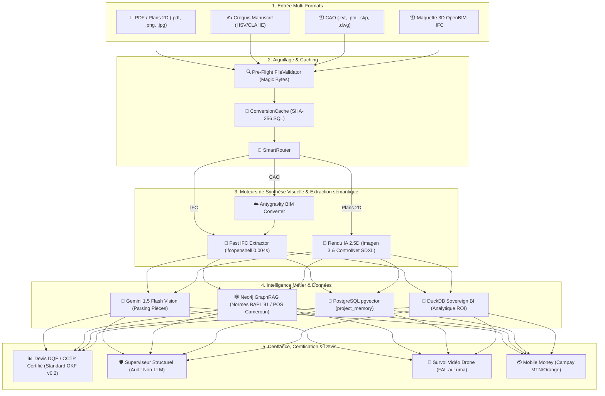

# 📋 Rapport Général des Fonctionnalités : Archi Cam AI
**Édition Spécifique :** Google Africa Applied AI Lab (Accra, 2026)  
**Nom du Promoteur :** Gervais, Maître d'œuvre & Chercheur en IA Appliquée  
**Affiliation :** Master Professionnel en IA Appliquée, Université de Ngaoundéré, Cameroun  
**Dépôt GitHub :** `https://github.com/gervais-afk/archi-cam-ai.git`  
**Contact :** `koagervais85@gmail.com` | `+237 695 35 34 02`

---

## 🏛️ Architecture Globale des Fonctionnalités

---

## 📋 1. Entrée Multi-Formats & Aiguillage Intelligente

*   **Validation Pre-Flight (`FileValidator`)** : Ingestion sécurisée des fichiers. Analyse des premiers octets binaires (**Magic Bytes**) pour authentifier le format réel du fichier (`d0cf11e0` pour Revit, `49534f` pour IFC, `%PDF` pour PDF). Rejette les fichiers corrompus en quelques millisecondes.
*   **Cache de Conversion (`ConversionCache`)** : Calcule le hash SHA-256 du fichier d'origine et vérifie si le modèle IFC converti existe déjà en base de données. Évite les appels d'API redondants, économisant **60 secondes** et des crédits de traitement.
*   **Aiguillage Dynamique (`SmartRouter`)** : Aiguille automatiquement les fichiers vers le pipeline d'extraction IFC directe, le service de conversion cloud ou le moteur Vision IA 2D.
*   **Convertisseur BIM Cloud (`AntygravityConverter`)** : Traduit les formats CAO propriétaires verrouillés (Revit `.rvt`, ArchiCAD `.pln`, SketchUp `.skp`, DWG) en IFC standardisés en préservant l'intégrité des **Property Sets** (épaisseurs, matériaux, résistance).
*   **Mode "Sketch-to-Pro" (Croquis Manuscrit)** : Traitement d'images de croquis manuscrits par masquage HSV (pour effacer le quadrillage bleu/rouge du cahier) et égalisation adaptative CLAHE (pour supprimer les ombres).

---

## 🎨 2. Moteur de Rendu 2D & Rendu 3D Isométrique

*   **Scellement Morphologique Elliptique $40 \times 40$** : Obturation automatique des baies et menuiseries sur les plans 2D par fermeture morphologique pour empêcher les textures de déborder des pièces.
*   **Dual ControlNet FAL.ai (SDXL) & Imagen 3.0** : Génère des vues réalistes 3D isométriques sous un angle régulier de $45^\circ$, guidées par les cartes de profondeur (`controlnet-depth`) et de contours (`controlnet-canny`).
*   **Toiture Procédurale via Distance Transform** : Calcule le relief tridimensionnel des toitures à partir de leur masque plan bidimensionnel.
*   **Garde-Fou Hallucination (Validation Canny)** : Détecte les anomalies géométriques de l'IA en mesurant la déviation des contours par rapport au plan d'origine. Rejet du rendu si le score de déviation dépasse $0.35$.

---

## 🐍 3. Extraction Rapide de Quantités (Fast IFC Extractor)

*   **Extraction Sémantique Instantanée (`scripts/fast_extract_quantities.py`)** : Conçu pour traiter des maquettes géantes (jusqu'à 2 Go) sans saturer le serveur. Bypasse la génération géométrique 3D d'Open CASCADE (`ifcopenshell.geom`) qui provoque des fuites de mémoire. Analyse directement les nœuds Property/Quantity Sets via `ifcopenshell` en **0.004s**.
*   **Fallbacks Déterministes par Catégorie** : Si la maquette CAO d'origine a été mal exportée et ne contient pas de Property Sets, l'extracteur applique des dimensions réglementaires moyennes par catégorie (poteaux, dalles, poutres, murs) pour estimer les volumes de béton et surfaces de plancher.

---

## 🧠 4. IA Multi-Agents & Réseau de Données Souverain

*   **Google Gemini 1.5 Flash Vision** : Parse les étiquettes de texte pour cartographier les pièces et surfaces.
*   **Neo4j 5.20 GraphRAG (Bolt)** : Applique les règles de ferraillage de la norme **BAEL 91** et les contraintes réglementaires du **POS** local (CES max, recul route, hauteur maximale par rapport aux zones de Yaoundé/Douala).
*   **PostgreSQL `pgvector`** : Recherche sémantique d'architectures antérieures similaires dans la table `project_memory`.
*   **DuckDB 1.5.5 Sovereign BI Engine** : Calcule les courbes d'inflation des matériaux, le ROI d'isolation et les statistiques de conversions.

---

## 📊 5. Moteur Financier DQE/CCTP & Paiement Mobile Money

*   **Attestation Géométrique Standard OKF v0.2** : Calcul mathématique déterministe au kg/m³ près pour la ventilation du devis Gros Œuvre (Béton, Aciers FeE500, Coffrage, Maçonnerie de parpaings).
*   **XAI Surlignage Interactif** : Surlignage en temps réel de la boîte de délimitation (Bounding Box) de l'élément structurel sur le plan 2D lorsque le curseur survole la ligne de devis correspondante.
*   **Recharge Mobile Money CamPay** : Intégration locale camerounaise pour l'acceptation de **MTN Mobile Money** et **Orange Money** via invite USSD push en Francs CFA (Packs Découverte, Pro et Bureau d'Études).
*   **Mode Hors-Ligne Edge (`lib/offline-fallback.ts`)** : Bascule transparente sur le moteur analytique DuckDB et traitements OpenCV en mémoire locale en cas de perte de connectivité internet sur le chantier.
