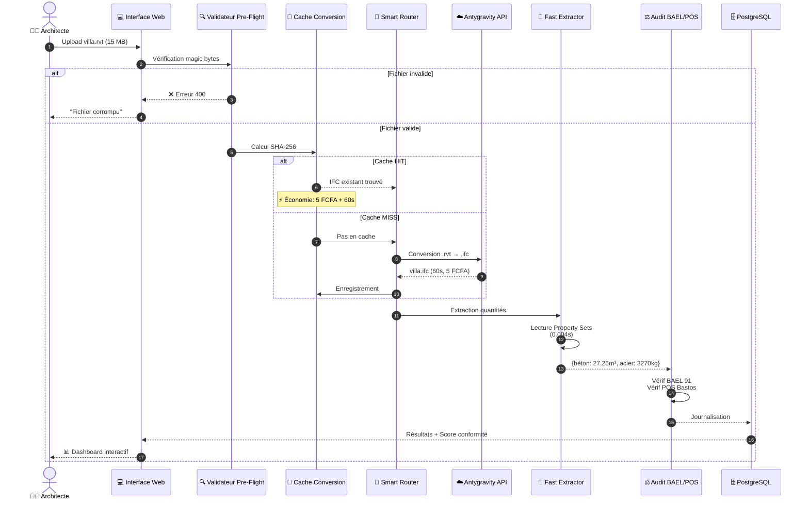

# 03 - Diagramme de Séquence Interactif

Le diagramme ci-dessous illustre le cycle de vie complet d'une demande de traitement de fichier d'architecture, depuis le téléversement de la maquette CAO jusqu'à la restitution du DQE et du score de conformité.

